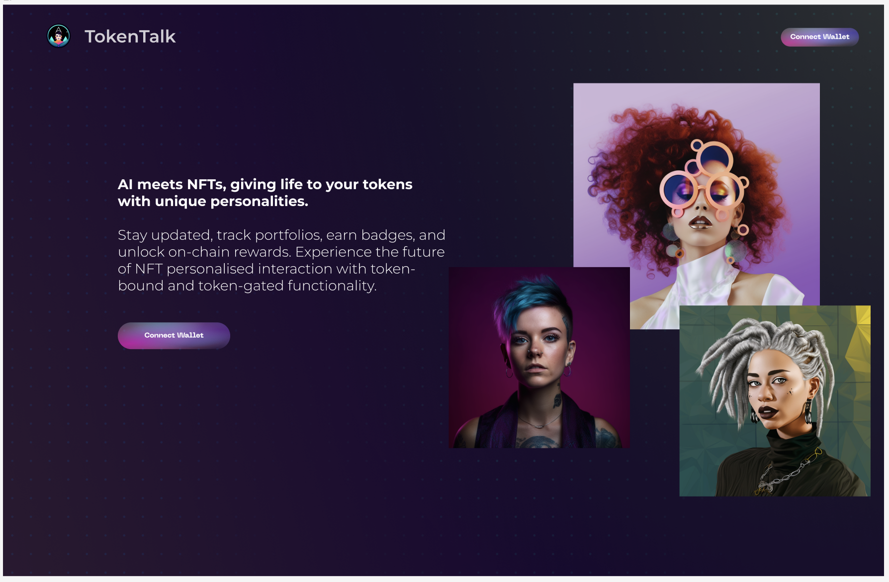
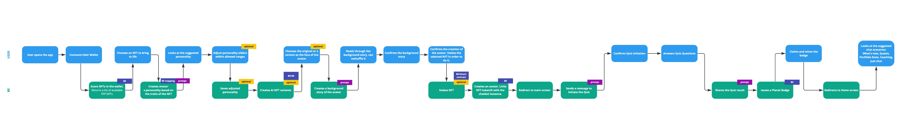

# NFT Charcater Core Backend service

## Description:

It provides the core functionality for managing NFT characters based on OpenAI's API. 
The service integrates with various dependencies including ethers, Langchain, and Pinecone 
for database management, blockchain interaction, and specific functionality related to NFT
character context, memory, etc. 

[Frontend](https://github.com/DenisPopov15/nft-character-web)

## UI



## Architecture/Flow



## Swagger Api Docs:
Start server and check:
```
http://localhost:3333/docs/
```

## Variables
Create `.env` from `.env.example` and set secrets

## Requirements:
- Installed Docker
- Installed Node and Npm

## Setup
```
npm install
npm run infrasetup
npm test

npm start
```

